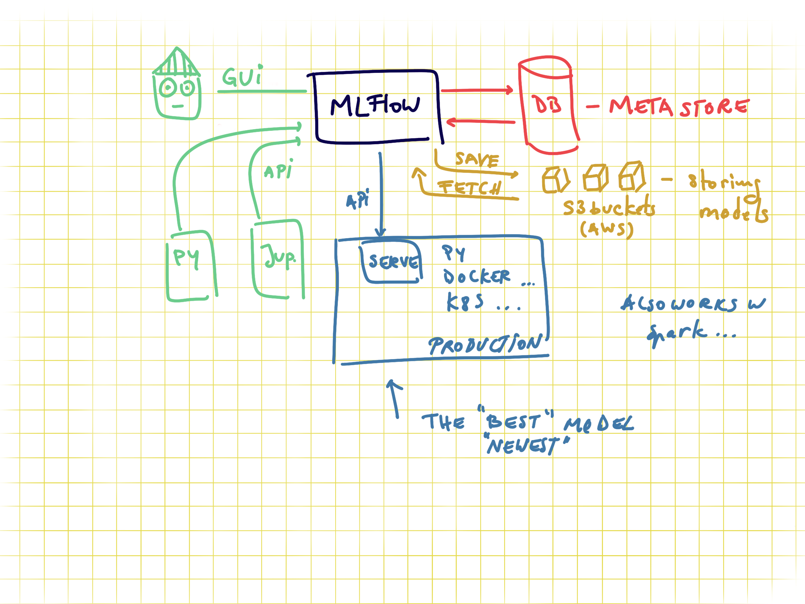

# ds-modeling-pipeline

Here you find a Skeleton project for building a simple model in a python script or notebook and log the results on MLFlow.

There are two ways to do it: 
* In Jupyter Notebooks:
    We train a simple model in the [jupyter notebook](notebooks/EDA-and-modeling.ipynb), where we select only some features and do minimal cleaning. The hyperparameters of feature engineering and modeling will be logged with MLflow

* With Python scripts:
    The [main script](modeling/train.py) will go through exactly the same process as the jupyter notebook and also log the hyperparameters with MLflow

Data used is the [coffee quality dataset](https://github.com/jldbc/coffee-quality-database).

## Requirements:

- pyenv with Python: 3.11.3

### Setup

Use the requirements file in this repo to create a new environment.

```BASH
make setup

#or

pyenv local 3.11.3
python -m venv .venv
source .venv/bin/activate
pip install --upgrade pip
pip install -r requirements_dev.txt
```

The `requirements.txt` file contains the libraries needed for deployment.. of model or dashboard .. thus no jupyter or other libs used during development.

The MLFLOW URI should **not be stored on git**, you have two options, to save it locally in the `.mlflow_uri` file:

```BASH
echo http://127.0.0.1:5000/ > .mlflow_uri
```

This will create a local file where the uri is stored which will not be added on github (`.mlflow_uri` is in the `.gitignore` file). Alternatively you can export it as an environment variable with

```bash
export MLFLOW_URI=http://127.0.0.1:5000/
```

This links to your local mlflow, if you want to use a different one, then change the set uri.

The code in the [config.py](modeling/config.py) will try to read it locally and if the file doesn't exist will look in the env var.. IF that is not set the URI will be empty in your code.

## Usage

### Creating an MLFlow experiment

You can do it via the GUI or via [command line](https://www.mlflow.org/docs/latest/tracking.html#managing-experiments-and-runs-with-the-tracking-service-api) if you use the local mlflow:

```bash
mlflow experiments create --experiment-name 0-template-ds-modeling
```

Check your local mlflow

```bash
mlflow ui
```

and open the link [http://127.0.0.1:5000](http://127.0.0.1:5000)

This will throw an error if the experiment already exists. **Save the experiment name in the [config file](modeling/config.py).**

In order to train the model and store test data in the data folder and the model in models run:

```bash
#activate env
source .venv/bin/activate

python -m modeling.train
```

In order to test that predict works on a test set you created run:

```bash
python modeling/predict.py models/linear data/X_test.csv data/y_test.csv
```

## About MLFLOW -- delete this when using the template

MLFlow is a tool for tracking ML experiments. You can run it locally or remotely. It stores all the information about experiments in a database.
And you can see the overview via the GUI or access it via APIs. Sending data to mlflow is done via APIs. And with mlflow you can also store models on S3 where you version them and tag them as production for serving them in production.


### MLFlow GUI

You can group model trainings in experiments. The granularity of what an experiment is up to your usecase. Recommended is to have an experiment per data product, as for all the runs in an experiment you can compare the results.


### Code to send data to MLFlow

In order to send data about your model you need to set the connection information, via the tracking uri and also the experiment name (otherwise the default one is used). One run represents a model, and all the rest is metadata. For example if you want to save train MSE, test MSE and validation MSE you need to name them as 3 different metrics.
If you are doing CV you can set the tracking as nested.


### MLFlow metadata

There is no constraint between runs to have the same metadata tracked. I.e. for one run you can track different tags, different metrics, and different parameters (in cv some parameters might not exist for some runs so this .. makes sense to be flexible).

- tags can be anything you want.. like if you do CV you might want to tag the best model as "best"
- params are perfect for hypermeters and also for information about the data pipeline you use, if you scaling vs normalization and so on
- metrics.. should be numeric values as these can get plotted


## BST

For all following steps move into the BST submodule: 

```bash 
cd submodule_bst
```

### Setup

```bash
make setup
``` 

### Data for Inference Test

1. Download `dataset_npy_between_2_hits_with_max_limits.rar` from https://drive.usercontent.google.com/download?id=1k_6yFUh3xgF6emSyWc-qcTvf_0cRghzq&export=download&authuser=0

2. Unrar to `dataset_npy_between_2_hits_with_max_limits` 

3. Inside `stroke_classification/preparing_data`, create folder `ShuttleSet_data_merged`

4. Inside `ShuttleSet_data_merged`, place folder `dataset_npy_between_2_hits_with_max_limits` 

The final folder structure is `stroke_classification/preparing_data/ShuttleSet_data_merged/dataset_npy_between_2_hits_with_max_limits`. 

### Model Weights

1. Search and download `bst_CG_AP_JnB_bone_between_2_hits_with_max_limits_seq_100_merged_2.pt` from https://drive.google.com/drive/folders/1D4172WZDJWPvpJdpaHDhy_cA-s8F-zR5

2. Inside `stroke_classification`, create folder `weight`

3. Inside `weight`, place file `bst_CG_AP_JnB_bone_between_2_hits_with_max_limits_seq_100_merged_2.pt`

The final folder/file structure is `stroke_classification/weight/bst_CG_AP_JnB_bone_between_2_hits_with_max_limits_seq_100_merged_2.pt`

### Run Inference Test

1. Move inside `stroke_classification` with: 
```bash
cd stroke_classification
``` 
2. Then run: 
```bash
python main_on_shuttleset/bst_infer.py
``` 

The original `bst_infer.py` just printed the raw classes. I changed the original script to output evaluation results (same metrics as in publication) like the following: 

```bash
==================================================
EVALUATION RESULTS
==================================================
Accuracy:      0.8377 (83.77%)
Macro-F1:      0.8209
Min-F1:        0.6108
Top-2 Accuracy: 0.9617 (96.17%)
==================================================
Total samples: 3499
Correct predictions: 2931
Wrong predictions: 568

Per-class F1 scores:
 0. 未知球種                 F1: 0.8355
 1. Top_放小球              F1: 0.8750
 2. Top_擋小球              F1: 0.7904
 3. Top_殺球               F1: 0.8819
 4. Top_挑球               F1: 0.8238
 5. Top_長球               F1: 0.9624
 6. Top_平球               F1: 0.6108
 7. Top_切球               F1: 0.8516
 8. Top_推球               F1: 0.6930
 9. Top_撲球               F1: 0.7619
10. Top_勾球               F1: 0.6465
11. Top_發短球              F1: 0.9348
12. Top_發長球              F1: 0.9130
13. Bottom_放小球           F1: 0.8597
14. Bottom_擋小球           F1: 0.7758
15. Bottom_殺球            F1: 0.9011
16. Bottom_挑球            F1: 0.8097
17. Bottom_長球            F1: 0.9869
18. Bottom_平球            F1: 0.6766
19. Bottom_切球            F1: 0.8597
20. Bottom_推球            F1: 0.7099
21. Bottom_撲球            F1: 0.7586
22. Bottom_勾球            F1: 0.7107
23. Bottom_發短球           F1: 0.9712
24. Bottom_發長球           F1: 0.9231
``` 